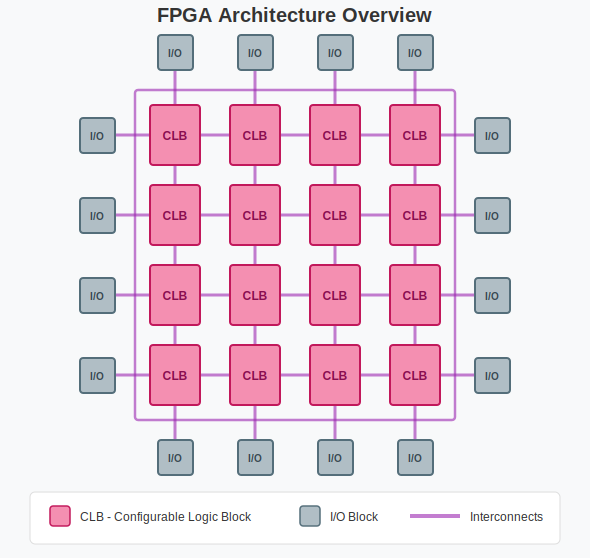
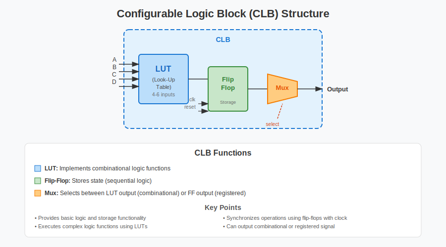
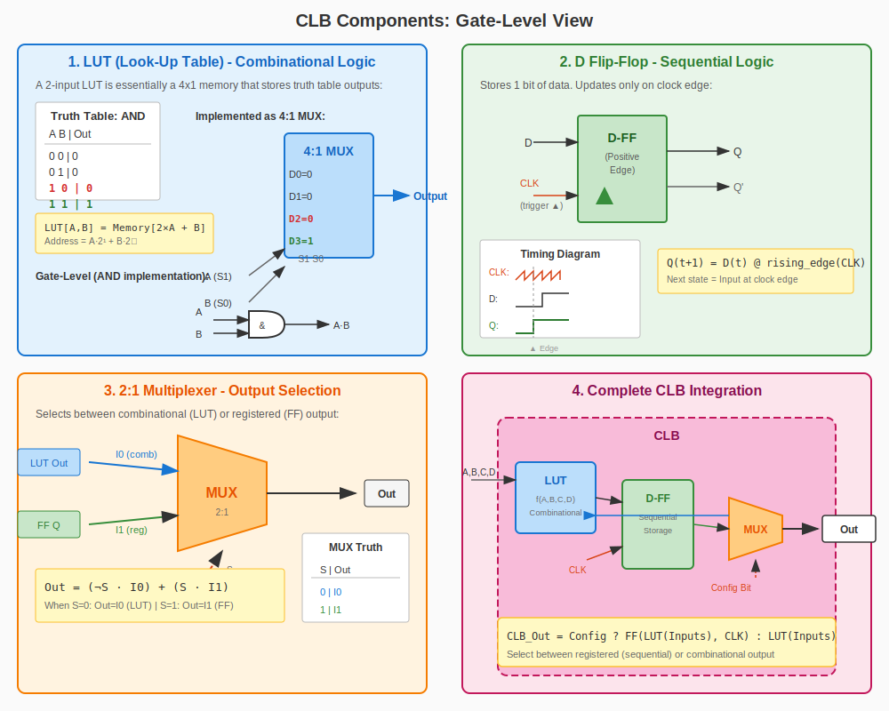

# FPGA Practical Labs

> Hands-on FPGA laboratory  
> From blink LED to RISC-V softcore — learn FPGA by doing!

[](LICENSE)
[](https://wiki.sipeed.com/hardware/en/tang/Tang-Nano-9K/Nano-9K.html)
[](CONTRIBUTING.md)

[Documentation](docs/) · [Hardware](hardware/)

---

## What is an FPGA?

An **FPGA** (Field-Programmable Gate Array) is a semiconductor device that can be reprogrammed to implement various digital circuits and functions. Unlike ASICs, FPGAs offer flexibility and adaptability, allowing designers to modify functionality even after manufacturing.

### FPGA Architecture Overview



An FPGA consists of three fundamental building blocks:

1. **Configurable Logic Blocks (CLBs)** - The basic computational units
2. **Interconnect Architecture** - Programmable routing between blocks
3. **Input/Output Blocks** - Interfaces to external devices

### Configurable Logic Block (CLB) Structure



Each CLB contains:

- **LUT (Look-Up Table)** - Implements combinational logic functions
- **Flip-Flop** - Stores state for sequential logic
- **Multiplexer** - Selects between combinational or registered output

The CLB provides the basic logic and storage functionality, executes complex logic functions, and synchronizes operations using flip-flops with a clock signal.

### Gate-Level Implementation



*Figure: Detailed gate-level view of CLB components*

The diagram above shows how each CLB component works at the logic gate and mathematical level:

**1. LUT (Look-Up Table)**
- Mathematically: A LUT with *n* inputs implements any Boolean function of *n* variables
- A 2-input LUT is a 4×1 memory: `Output = Memory[2×A + B]`
- Gate equivalent: Can implement AND, OR, XOR, or any truth table

**2. D Flip-Flop**
- Mathematical model: `Q(t+1) = D(t)` when clock rises (▲)
- Stores 1 bit of state synchronously
- Output only changes on the rising edge of CLK

**3. 2:1 Multiplexer**
- Boolean equation: `Out = (¬Select · LUT_Out) + (Select · FF_Out)`
- Selects between: S=0 (combinational path) or S=1 (registered path)

**4. Complete CLB**
- Unified equation: `CLB_Out = Config ? FF(LUT(Inputs), CLK) : LUT(Inputs)`

---

## Documentation

Start here if you are new to FPGAs:

1. [What is FPGA?](docs/01-what-is-fpga.md) - Fundamental concepts
2. [Basic Verilog](docs/02-basic-verilog.md) - Syntax and structure
3. [FPGA vs Microcontroller](docs/03-fpga-vs-microcontroller.md) - Understand the differences
4. [Gowin IDE Installation](docs/04-gowin-ide-installation.md) - Set up your environment

---

## Getting Started

```bash
# 1. Clone the repository
git clone https://github.com/yourusername/fpga-practical-labs.git
cd fpga-practical-labs

# 2. Install tools (see docs/)

# 3. Check available projects
cd projects/

# 4. Start with Toggle LED
cd Toggle_led/
```

## Projects

| Project | Description | Status |
|---------|-------------|--------|
| [Toggle LED](projects/Toggle_led/) | Basic LED toggle using Tang Nano 9K | ✅ Available |
| [Servo Control](projects/Servo_control/) | Servo motor control with progress LEDs | ✅ Available |

---

## License

This project is licensed under:

- **Code**: [MIT License](LICENSE) 2026 FPGA Practical Labs Contributors
- **Documentation**: [CC BY-SA 4.0](https://creativecommons.org/licenses/by-sa/4.0/)

---

## Support

If this project helped you, consider giving it a star!