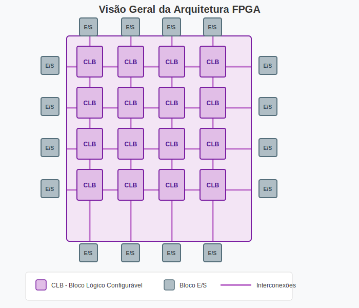
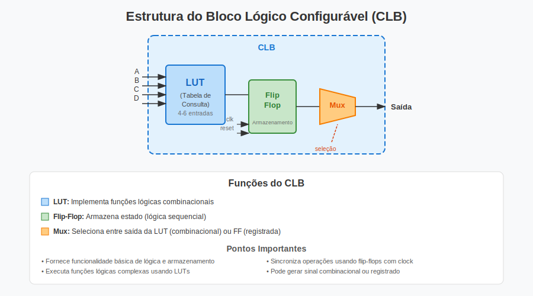

# O que é FPGA?

## Definição

**FPGA** (Field-Programmable Gate Array ou Matriz de Portas Programáveis em Campo) é um dispositivo semicondutor que pode ser reprogramado para implementar diversos circuitos e funções digitais. Ao contrário dos ASICs (Circuitos Integrados de Aplicação Específica), que são dispositivos de função fixa fabricados para um propósito específico, os FPGAs oferecem flexibilidade e adaptabilidade sem paralelo. Os projetistas podem modificar a funcionalidade do dispositivo mesmo após ele ter sido fabricado e implantado em campo.

Essa reprogramabilidade torna os FPGAs uma opção atrativa para:
- **Prototipagem rápida** - Testar e validar conceitos de projeto rapidamente
- **Desenvolvimento de prova de conceito** - Demonstrar viabilidade antes de comprometer com produção em ASIC
- **Aplicações com requisitos em evolução** - Adaptar-se a padrões ou protocolos em mudança

## Arquitetura

No coração de um FPGA está uma matriz de **blocos lógicos programáveis** e **interconexões programáveis**. Essa arquitetura permite a implementação de circuitos digitais que vão de portas lógicas simples a sistemas complexos de processamento digital de sinais.

*Figura 1: Arquitetura do FPGA mostrando CLBs (Blocos Lógicos Configuráveis), blocos de I/O e interconexões programáveis*

Um FPGA consiste em três blocos fundamentais:

1. **Blocos Lógicos Configuráveis (CLBs)** - As unidades computacionais básicas que implementam lógica digital
2. **Arquitetura de Interconexão** - Roteamento programável que conecta os blocos
3. **Blocos de Entrada/Saída** - Interfaces para conexão com dispositivos externos

### Estrutura do Bloco Lógico Configurável (CLB)

Cada CLB contém os componentes essenciais para construir circuitos digitais:

*Figura 2: Estrutura interna de um Bloco Lógico Configurável*

O CLB consiste em três elementos essenciais:

- **LUT (Look-Up Table)** - Implementa funções lógicas combinacionais armazenando tabelas-verdade
- **Flip-Flop** - Armazena estado para operações de lógica sequencial
- **Multiplexador** - Seleciona entre saída combinacional (LUT) ou registrada (Flip-Flop)

### Implementação a Nível de Portas

*Figura 3: Visão detalhada em nível de portas lógicas dos componentes do CLB*

O diagrama acima mostra como cada componente do CLB funciona no nível de portas lógicas e matemático:

**1. LUT (Look-Up Table)**
- Matematicamente: Uma LUT com *n* entradas implementa qualquer função Booleana de *n* variáveis
- Uma LUT de 2 entradas é uma memória 4×1: `Saída = Memória[2×A + B]`
- Equivalente em portas: Pode implementar AND, OR, XOR ou qualquer tabela-verdade
- Exemplo: Porta AND armazenada nos endereços: mem[0]=0, mem[1]=0, mem[2]=0, mem[3]=1

**2. Flip-Flop D**
- Modelo matemático: `Q(t+1) = D(t)` quando o clock sobe (▲)
- Armazena 1 bit de estado sincronamente
- Equação característica: Próximo estado igual à entrada na borda do clock
- Saída só muda na borda de subida do CLK

**3. Multiplexador 2:1**
- Equação Booleana: `Saída = (¬Seleção · Saída_LUT) + (Seleção · Saída_FF)`
- Seleciona entre:
  - S=0: Caminho combinacional (saída direta da LUT)
  - S=1: Caminho registrado (saída do flip-flop)
- Controlado por um bit de configuração programado no FPGA

**4. CLB Completo**
- Equação unificada: `Saída_CLB = Config ? FF(LUT(Entradas), CLK) : LUT(Entradas)`
- Permite lógica combinacional e sequencial em uma única unidade

### Interconexões

As interconexões fornecem a infraestrutura de roteamento que liga os blocos lógicos entre si. Essa rede de fios e chaves programáveis possibilita:

- Conexões flexíveis entre quaisquer blocos lógicos
- Implementação de circuitos maiores e mais complexos
- Roteamento de sinais com mínimo atraso e consumo de energia

## Comparação FPGA vs ASIC

| Aspecto | FPGA | ASIC |
|---------|------|------|
| Funcionalidade | Reprogramável | Fixa após fabricação |
| Tempo de Desenvolvimento | Semanas a meses | Meses a anos |
| Custo Inicial | Baixo (sem NRE) | Muito Alto (máscaras caras) |
| Custo Unitário (Alto Volume) | Mais Alto | Mais Baixo |
| Flexibilidade | Pode ser atualizado em campo | Não pode ser alterado |
| Desempenho | Bom | Otimizado para função específica |
| Consumo de Energia | Moderado | Otimizado e mais baixo |

## Principais Vantagens

Os FPGAs oferecem vários benefícios convincentes que os tornam adequados para uma ampla gama de aplicações:

- **Flexibilidade de Projeto** - Modificar funcionalidade sem fabricar novo silício
- **Menor Time-to-Market** - Pular o longo e caro processo de fabricação de ASICs
- **Menor Risco** - Corrigir bugs e adicionar recursos após implantação
- **Processamento Paralelo** - Executar múltiplas operações simultaneamente para alta vazão
- **Latência Determinística** - Comportamento de timing previsível para sistemas em tempo real

## Aplicações Comuns

Os FPGAs são amplamente implantados em indústrias onde desempenho, flexibilidade e desenvolvimento rápido são críticos:

- **Telecomunicações** - Estações base, processamento de rede, manipulação de protocolos
- **Automotivo** - ADAS, fusão de sensores, prototipagem de ECUs
- **Aeroespacial e Defesa** - Sistemas de radar, comunicações seguras, aviônica
- **Data Centers** - Aceleração de cargas de trabalho de IA/ML, SmartNICs, transcodificação de vídeo
- **Automação Industrial** - Sistemas de controle em tempo real, robótica, acionamento de motores
- **Teste e Medição** - Aquisição de dados em alta velocidade, processamento de sinais

---
*Próximo: [02-basic-verilog.pt.md](02-basic-verilog.pt.md)*
