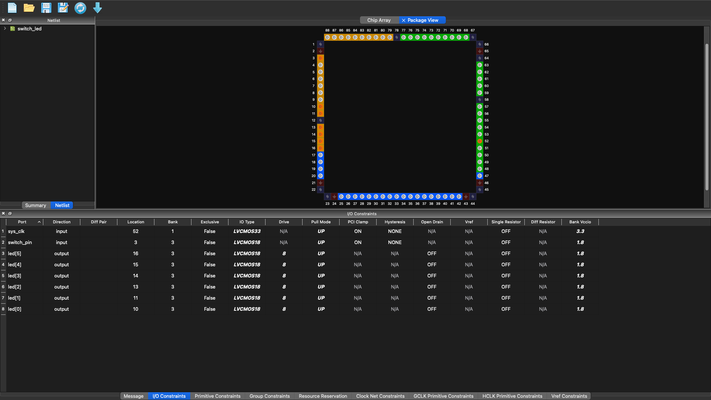
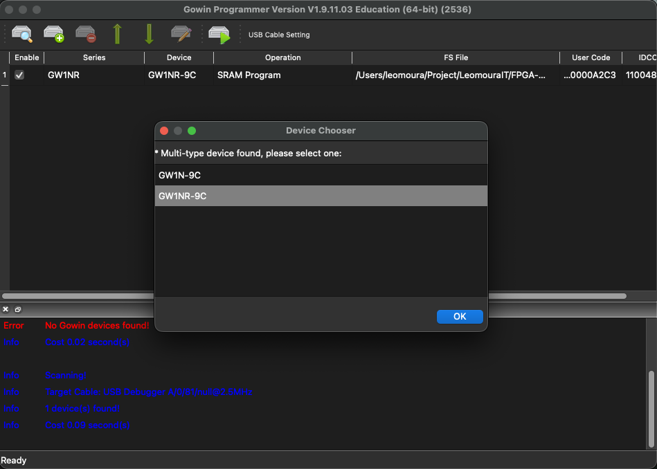
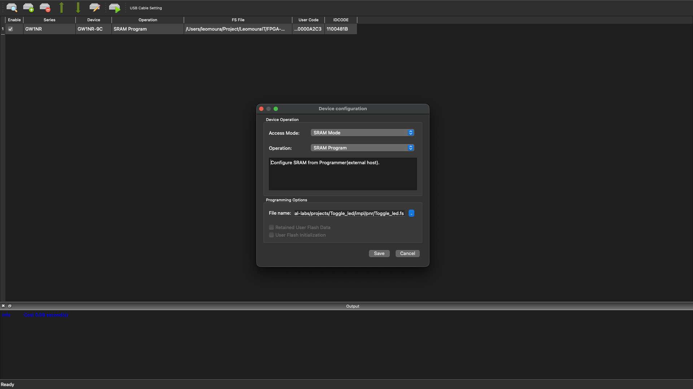

# Toggle LED - Tang Nano 9K

> Sistema de controle ON/OFF via botão com debounce e toggle em FPGA

## Indice

- [Visao Geral](#visao-geral)
- [Arquitetura do Sistema](#arquitetura-do-sistema)
- [Hardware](#hardware)
- [Firmware](#firmware)
- [Funcionamento Detalhado](#funcionamento-detalhado)
- [Como Usar](#como-usar)
- [Referencias](#referencias)

---

## Visao Geral

Este projeto implementa um **sistema de controle toggle** em FPGA, onde um botão físico alterna o estado de 6 LEDs entre ligado e desligado. A solução demonstra conceitos fundamentais de design digital síncrono, incluindo sincronização de sinais externos, debounce mecânico e lógica de toggle em Verilog.


*Demonstracao: Aperto do botao alterna todos os 6 LEDs ligado/desligado*

### Objetivos de Aprendizado

- Sincronização de sinais assíncronos (botão → clock do sistema)
- Debounce de chaves mecânicas
- Lógica de toggle (alternância de estado)
- Detecção de borda de descida
- Mapeamento de pinos físicos em FPGA

---

## Arquitetura do Sistema

```
+-------------------------------------------------------------+
|                    DIAGRAMA DE BLOCOS                       |
+-------------------------------------------------------------+
|                                                             |
|  +-------------+      +-----------------+      +---------+  |
|  |   BOTAO S1  |----->|  SINCRONIZADOR  |----->| DEBOUNCE|  |
|  |   (Pino 3)  |      |  (REGISTRADOR)  |      | ~5.4ms  |  |
|  |  Externo/   |      |                 |      |         |  |
|  |  Mecanico   |      | Armazena estado |      | Elimina |  |
|  |             |      |  anterior       |      | bounce  |  |
|  +-------------+      +-----------------+      +----+----+  |
|                                                     |       |
|                                                     v       |
|                                              +---------+    |
|                                              |  TOGGLE |    |
|                                              |  LOGIC  |    |
|                                              |         |    |
|                                              | Inverte |    |
|                                              | estado  |    |
|                                              | LEDs    |    |
|                                              +----+----+    |
|                                                   |         |
|                                                   v         |
|                                            +-------------+  |
|                                            |  6 LEDs     |  |
|                                            |  (Pinos     |  |
|                                            |   10-16)    |  |
|                                            +-------------+  |
|                                                             |
|  CLOCK: 50 MHz (assumido no código)                         |
|         27 MHz (Tang Nano 9K real)                          |
|                                                             |
+-------------------------------------------------------------+
```

---

## Hardware

### Especificacoes da Placa

| Componente | Especificacao |
|------------|---------------|
| FPGA | Gowin GW1NR-9C |
| LUTs | 8.640 |
| Clock | 27 MHz (cristal onboard) - Ver nota abaixo |
| LEDs | 6x LED (ativos em alto) |
| Botoes | 2x botao tatil (S1, S2) |

> **Nota sobre Clock:** O código foi projetado assumindo um clock de **50 MHz**, onde 270.000 ciclos resultam em ~5.4ms de debounce. No Tang Nano 9K, o clock real é **27 MHz**, resultando em um tempo de debounce real de ~10ms (270.000 / 27.000.000).

### Mapeamento de Pinos

| Sinal | Pino FPGA | Funcao | Direcao | Padrao I/O |
|-------|-----------|--------|---------|------------|
| `sys_clk` | 52 | Clock do sistema | Entrada | LVCMOS33 |
| `switch_pin` | 3 | Botao S1 | Entrada | LVCMOS18 |
| `led[0]` | 10 | LED 0 | Saida | LVCMOS18 |
| `led[1]` | 11 | LED 1 | Saida | LVCMOS18 |
| `led[2]` | 13 | LED 2 | Saida | LVCMOS18 |
| `led[3]` | 14 | LED 3 | Saida | LVCMOS18 |
| `led[4]` | 15 | LED 4 | Saida | LVCMOS18 |
| `led[5]` | 16 | LED 5 | Saida | LVCMOS18 |

### Caracteristicas Eletricas

**Botao S1 (Pino 3):**
```
+-- Pull-up interno ativo (PULL_MODE=UP)
+-- Nivel logico alto (1) quando solto: 1.8V (via pull-up)
+-- Nivel logico baixo (0) quando apertado: 0V (GND)
+-- IO_TYPE=LVCMOS18 (1.8V)
+-- Debounce necessario: ~5-20ms (mecanico)
```

**LEDs (Pinos 10-16):**
```
+-- Ativos em nivel alto (1 = aceso, 0 = apagado)
+-- Corrente: 8mA por LED (DRIVE=8)
+-- Tensao: 1.8V (BANK_VCCIO=1.8)
+-- Pull-up ativo para estado definido
```

**Clock (Pino 52):**
```
+-- Clock externo do oscilador onboard
+-- IO_TYPE=LVCMOS33 (3.3V)
+-- Frequencia: 27 MHz (Tang Nano 9K)
+-- Pull-up ativo
```

---

## Firmware

### Estrutura do Codigo

O firmware e implementado em **Verilog HDL** e consiste em um unico modulo sincrono.


*Criando um novo arquivo Verilog no Gowin IDE*

#### 1. Interface do Modulo

```verilog
module switch_led (
    input sys_clk,          // Clock do sistema (assumido 50MHz no código)
    input switch_pin,       // Entrada do botao S1 (ativo em baixo)
    output reg [5:0] led    // Saida para 6 LEDs
);
```

| Porta | Direcao | Largura | Descricao |
|-------|---------|---------|-----------|
| `sys_clk` | Entrada | 1 bit | Clock principal (27 MHz na placa, 50MHz no calculo) |
| `switch_pin` | Entrada | 1 bit | Sinal do botao (ativo em baixo, com pull-up) |
| `led` | Saida | 6 bits | Vetor de controle dos LEDs |

#### 2. Registradores Internos

```verilog
reg switch_prev;            // Estado anterior do botao (para deteccao de borda)
reg [19:0] debounce_cnt;    // Contador de debounce (20 bits)
```

| Registrador | Largura | Funcao |
|-------------|---------|--------|
| `switch_prev` | 1 bit | Armazena estado anterior do botao para deteccao de borda de descida |
| `debounce_cnt` | 20 bits | Contador para gerar atraso de debounce. Conta ate 270.000 ciclos |

**Por que 20 bits?**
- O contador precisa armazenar valores ate 270.000
- 2^18 = 262.144 (insuficiente)
- 2^19 = 524.288 (suficiente)
- 2^20 = 1.048.576 (usado, com margem)

#### 3. Inicializacao

```verilog
initial begin
    led = 6'b000000;        // LEDs iniciam apagados (todos em 0)
    switch_prev = 1'b1;     // Botao solto (pull-up interno mantem em 1)
    debounce_cnt = 20'd0;   // Contador zerado
end
```

O bloco `initial` define o estado de power-up do sistema. Em FPGAs, este bloco configura o valor inicial dos flip-flops apos a programacao.

#### 4. Logica Principal

```verilog
always @(posedge sys_clk) begin
    // Debounce: aguarda 270.000 ciclos entre amostras
    if (debounce_cnt < 20'd270000) begin
        debounce_cnt <= debounce_cnt + 1'b1;
    end else begin
        debounce_cnt <= 20'd0;
        
        // Atualiza estado anterior do botao
        switch_prev <= switch_pin;
        
        // Detecta borda de descida (1 → 0): botao foi apertado
        if (switch_prev && !switch_pin) begin
            led <= ~led;    // Inverte todos os bits (toggle)
        end
    end
end
```

---

## Funcionamento Detalhado

### Maquina de Estados Temporal

```
TEMPO -------------------------------------------------------->

sys_clk:    __________________________________________________
            ____/    \____/    \____/    \____/    \____/    
            ^    ^    ^    ^
         posedge posedge posedge posedge ... (pontos de execucao)

Botao S1:   __________________________________________________
            __________\_________/________________________________
                       ^         ^
                    aperta    solta
                    (bounce)   (estavel)

debounce_cnt: 0 → 270000 → 0 → 270000 → 0 → ...
                    ^              ^
                 (aguarda      (executa!
                  ~5.4ms)         toggle)

LEDs:       ........................############................
            (apagados)            (acesos)      (apagados...)
                                    ^
                                  toggle
                                  (inversao de bits)
```

### Analise do Debounce

**Por que e necessario?**
Chaves mecanicas apresentam "bounce" (tremulacao) ao serem acionadas:

```
Sinal ideal:     ______________________________________________
                 ___________/__________________________________

Sinal real:      ______________________________________________
                 ___________/\____/\__/________________________
                              ^  ^  ^
                           bounce (ruido)
                           dura ~5-20ms

Sem debounce:    FPGA ve multiplos apertos → toggle erratico
Com debounce:    FPGA ve 1 aperto limpo → toggle correto
```

**Calculo do periodo de debounce:**

O codigo assume clock de 50 MHz para o calculo:

```
Frequencia do clock (assumida): 50 MHz
Periodo do clock: 1 / 50.000.000 = 20 nanosegundos

Periodo de debounce desejado: 5.4 ms
Contagem necessaria: 5.4ms / 20ns = 270.000 ciclos
```

**No Tang Nano 9K (clock real de 27 MHz):**

```
Frequencia do clock (real): 27 MHz
Periodo do clock: 1 / 27.000.000 ≈ 37 nanosegundos

Periodo de debounce real: 270.000 × 37ns ≈ 10 ms
```

### Array do Chip e Layout Fisico

O **Floor Planner** mostra duas visualizacoes importantes de como seu codigo Verilog e implementado fisicamente no silicio do FPGA:

#### Array do Chip (Matriz de Blocos Logicos)

O FPGA fisico e organizado como uma **matriz bidimensional** de blocos logicos configuraveis (CLBs):

```
+-------------------------------------------------------------+
|                    ARRAY DO CHIP GW1NR-9                    |
+-------------------------------------------------------------+
|                                                             |
|  +-----+ +-----+ +-----+ +-----+         +-----+ +-----+    |
|  | CLB | | CLB | | CLB | | CLB |   ...   | CLB | | I/O |     <-- Pinos 10-16
|  |(0,0)| |(0,1)| |(0,2)| |(0,3)|         |     | |LEDs |    |
|  +--+--+ +--+--+ +--+--+ +--+--+         +--+--+ +--+--+    |
|     |       |       |       |               |       |       |
|  +--+--+ +--+--+ +--+--+ +--+--+         +--+--+ +--+--+    |
|  | CLB | | CLB | | FF  | | FF  |   ...   | FF  | | I/O |    |
|  |     | |     | |cnt0 | |cnt1 |         |cnt19| | S1  |     <-- Pino 3
|  +--+--+ +--+--+ +--+--+ +--+--+         +--+--+ +--+--+    |
|     |       |       |       |               |       |       |
|  +--+--+ +--+--+ +--+--+ +--+--+         +--+--+ +--+--+    |
|  | CLB | | CLB | | FF  | | FF  |   ...   | FF  | | I/O |    |
|  |     | |     | |led0 | |led1 |         |led5 | | CLK |     <-- Pino 52
|  +-----+ +-----+ +-----+ +-----+         +-----+ +-----+    |
|                                                             |
|       ... (matriz continua por toda a area do chip) ...     |
|                                                             |
|  +-----------------------------------------------------+    |
|  |           MATRIZ DE INTERCONEXAO                    |    |
|  |  (Fios programaveis conectando CLBs entre si)       |    |
|  +-----------------------------------------------------+    |
|                                                             |
+-------------------------------------------------------------+
```

**Componentes do Array:**

| Elemento | Abreviacao | Funcao |
|----------|------------|--------|
| **Configurable Logic Block** | CLB | Unidade basica de logica programavel. Contem LUTs e Flip-Flops |
| **Look-Up Table** | LUT | Implementa funcoes logicas combinacionais (AND, OR, XOR, etc.) |
| **Flip-Flop** | FF | Armazena 1 bit de estado (registradores como `led`, `debounce_cnt`) |
| **I/O Block** | IOB | Interface entre o nucleo do FPGA e os pinos fisicos externos |
| **Matriz de Interconexao** | - | Rede de fios programaveis que roteia sinais entre CLBs |

#### Do Codigo ao Silicio

O processo de compilacao transforma seu codigo em elementos fisicos:

```
+------------------------------------------------------------------+
|  ETAPA 1: Codigo Verilog (Abstrato)                              |
+------------------------------------------------------------------+
|  reg [5:0] led;           <- Vetor de 6 registradores            |
|  reg [19:0] debounce_cnt; <- Contador de 20 bits                 |
|  always @(posedge sys_clk) ...                                   |
|      led <= ~led;         <- Inversao bit a bit                  |
+------------------------------------------------------------------+
                            v SINTESE
                            
+------------------------------------------------------------------+
|  ETAPA 2: Netlist (Lista de Componentes)                         |
+------------------------------------------------------------------+
|  * 27 Flip-Flops (6 para led + 20 para contador + 1 para prev)  |
|  * 6 Inversores (NOT bit a bit para led <= ~led)                 |
|  * 1 Comparador de 20 bits (debounce_cnt < 270000)               |
|  * 1 Somador de 20 bits (debounce_cnt + 1)                       |
|  * Portas logicas AND (deteccao de borda)                        |
+------------------------------------------------------------------+
                            v PLACE & ROUTE
                            
+------------------------------------------------------------------+
|  ETAPA 3: Layout Fisico (Alocacao no Array)                      |
+------------------------------------------------------------------+
|  * FF led[0] → CLB(2,3)  ---Rota---> IOB → Pino 10 (LED0)        |
|  * FF led[1] → CLB(2,4)  ---Rota---> IOB → Pino 11 (LED1)        |
|  * FF led[5] → CLB(3,5)  ---Rota---> IOB → Pino 16 (LED5)        |
|  * FF cnt[0:19] → CLBs(4,1) a (4,5) (contador agrupado)          |
|  * Entrada S1 → IOB(Pino 3) ---Rota---> CLB(5,1)                 |
|  * Clock → IOB(Pino 52) ---Rota---> Matriz de clock global       |
+------------------------------------------------------------------+
```

#### Visualizacao no Floor Planner

As imagens mostram:

**Netlist Chip Array:**
- Cada **ponto** representa um elemento fisico ocupando uma posicao na matriz
- **Pontos azuis**: Flip-flops (registradores que armazenam estado)
- **Pontos vermelhos/amarelos**: LUTs (logica combinacional)
- **Linhas**: Conexoes fisicas (rotas) entre os blocos

**Netlist Package:**
- Mostra a visao fisica do chip encapsulado (QN88 - 88 pinos)
- Indica onde estao localizados os pinos fisicos (Pino 3, 10, 11, etc.)
- Mostra a relacao entre os pinos logicos do seu codigo e os pinos fisicos do chip

#### Por que isso e importante?

| Aspecto | Descricao |
|---------|-----------|
| **Utilizacao de Recursos** | Visualiza quais areas do FPGA estao sendo usadas |
| **Timing** | Conexoes mais curtas (blocos proximos) = menor atraso de propagacao |
| **Restricoes Fisicas** | O arquivo `.cst` define que "Pino 3 = switch_pin", e o Floor Planner mostra onde isso esta fisicamente |
| **Debug** | Permite verificar se os componentes estao sendo posicionados de forma eficiente |

#### Analogia: FPGA como um Predio de Escritorios

| FPGA | Predio de Escritorios |
|------|----------------------|
| **Array do Chip** | O predio inteiro com seus andares e corredores |
| **CLB** | Uma sala de escritorio individual |
| **I/O Block** | A recepcao no terreo (conecta ao mundo exterior) |
| **Floor Plan** | A planta baixa mostrando quem ocupa qual sala |
| **Place & Route** | O arquiteto decidindo onde cada departamento fica e como os corredores conectam as salas |
| **Netlist** | A lista de funcionarios e com quem eles precisam se comunicar |

No seu projeto Toggle LED:
- O **departamento do contador** (20 flip-flops) ocupa varias salas adjacentes
- O **departamento dos LEDs** (6 flip-flops) fica perto das saidas (pinos 10-16)
- O **departamento do botao** fica perto da entrada (pino 3)
- Os **corredores** (fios de interconexao) carregam os sinais entre os departamentos

### Deteccao de Borda de Descida

A condicao `if (switch_prev && !switch_pin)` detecta a borda de descida:

**Tabela de Transicao:**

| Estado Anterior (`switch_prev`) | Estado Atual (`switch_pin`) | `!switch_pin` | Condicao | Evento |
|---------------------------------|----------------------------|---------------|----------|---------|
| 1 | 1 | 0 | 1 && 0 = 0 | Sem mudanca (alto) |
| 1 | 0 | 1 | 1 && 1 = 1 | **BORDA DE DESCIDA** |
| 0 | 1 | 0 | 0 && 0 = 0 | Borda de subida |
| 0 | 0 | 1 | 0 && 1 = 0 | Sem mudanca (baixo) |

**Explicacao dos operadores:**
- `&&` : Operador logico AND - retorna 1 apenas se ambos os operandos forem 1
- `!`  : Operador logico NOT - inverte o valor (0→1, 1→0)

A borda de descida (linha 2) ocorre quando o botao e pressionado (transicao de 1 para 0).

### Logica de Toggle

A operacao `led <= ~led` realiza a inversao bit a bit do vetor:

| Estado Atual | Operacao | Proximo Estado |
|--------------|----------|----------------|
| `000000` (0x00) | `~000000` | `111111` (0x3F) |
| `111111` (0x3F) | `~111111` | `000000` (0x00) |

**Diferenca entre `~` e `!` em Verilog:**
- `~` : NOT bit a bit - inverte cada bit individualmente (`~6'b001011 = 6'b110100`)
- `!` : NOT logico - retorna 1 bit: 1 se o valor for 0, 0 caso contrario (`!6'b001011 = 1'b0`)

---

## Como Usar

### Compilacao e Programacao

#### Fluxo de Desenvolvimento


*Acessando o Floor Planner para visualizar o layout fisico*


*Visualizacao do netlist no array do chip*


*Visualizacao do netlist no package do FPGA*

#### Passos

1. Abrir projeto no Gowin IDE
2. Verificar se os arquivos `toggle_led.v` e `Toggle_led.cst` estao incluidos
3. Synthesize (Ctrl+S ou botao verde)
4. Place & Route (Ctrl+R)


*Resultado do Place & Route mostrando o roteamento das conexoes*

5. Program Device (Ctrl+P ou botao download)


*Selecionando o dispositivo FPGA para programacao*


*Dispositivo detectado e pronto para programacao*

##### Modos de Programacao

**SRAM Mode** (para testes rapidos):
- O bitstream e carregado na memoria SRAM do FPGA
- Perde-se ao desligar a energia
- Util para desenvolvimento e debug


*Programacao em modo SRAM*

**External Flash Mode** (para uso permanente):
- O bitstream e gravado na memoria flash externa
- Persiste apos desligar
- O FPGA carrega automaticamente ao ligar


*Programacao na memoria flash externa*

##### Troubleshooting


*Mensagem de erro quando o cabo nao e detectado - verifique a conexao USB*

### Operacao

| Acao | Resultado |
|------|-----------|
| Conectar USB | LED power acende (indica alimentacao) |
| 1o aperto em S1 | Todos os 6 LEDs acendem |
| 2o aperto em S1 | Todos os 6 LEDs apagam |
| Manter S1 pressionado | Nenhum efeito (espera soltar para proximo ciclo) |

---

## Referencias

### Documentacao Tecnica

- [Tang Nano 9K Wiki](https://wiki.sipeed.com/hardware/en/tang/Tang-Nano-9K/Nano-9K.html)

### Conceitos Relacionados

| Conceito | Descricao |
|----------|-----------|
| **Debounce** | Tecnica para eliminar ruido de chaves mecanicas |
| **Borda de descida** | Transicao de sinal de alto (1) para baixo (0) |
| **Toggle** | Alternancia de estado (ON ↔ OFF) |
| **Clock sincrono** | Sistema onde operacoes ocorrem em bordas de clock |

---

## Consumo de Recursos

| Recurso | Utilizado | Disponivel | Percentual |
|---------|-----------|------------|------------|
| LUTs | ~12 | 8.640 | ~0,14% |
| FFs | 22 | 6.480 | ~0,34% |
| BSRAM | 0 | 26 | 0% |
| PLL | 0 | 2 | 0% |

---

**Licenca:** MIT © 2026 FPGA Practical Labs Contributors
